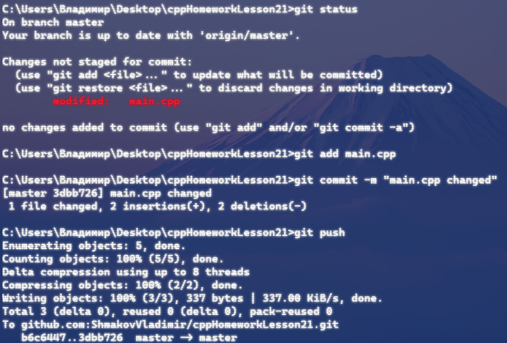
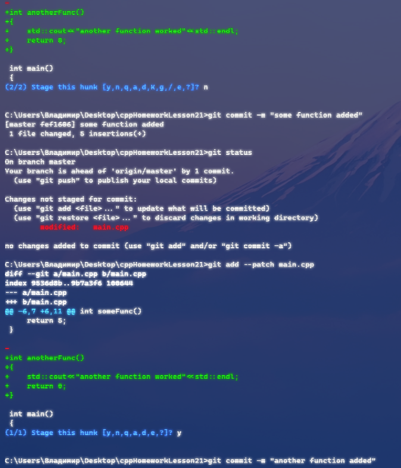
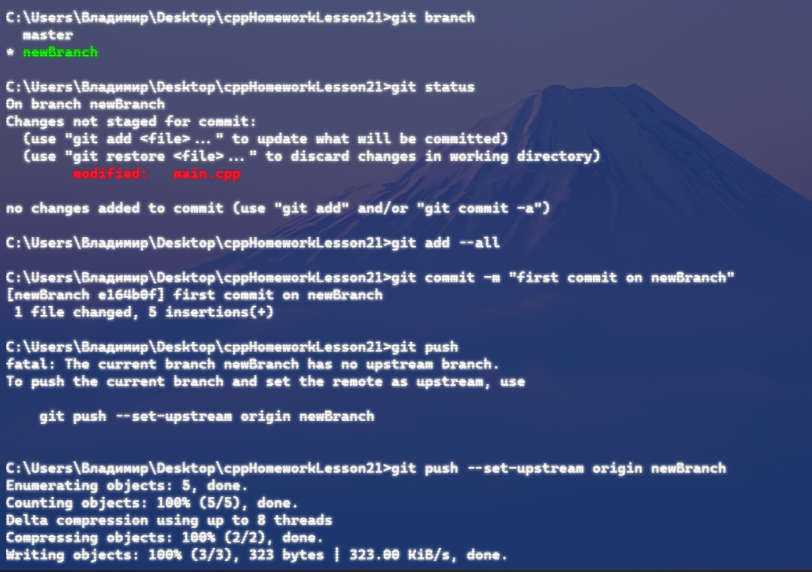
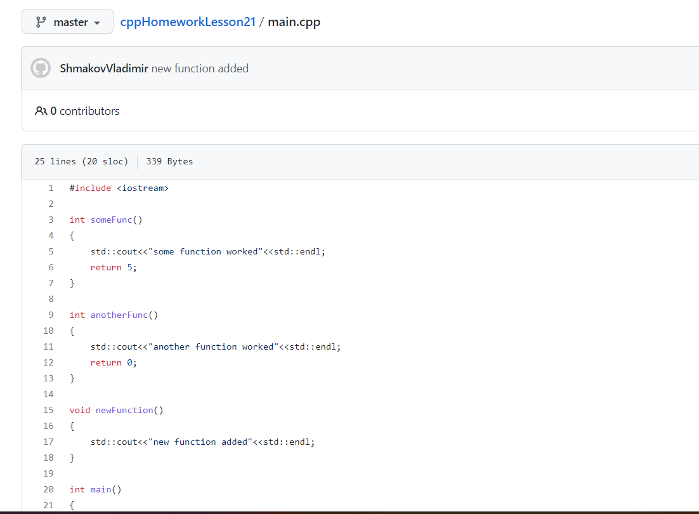
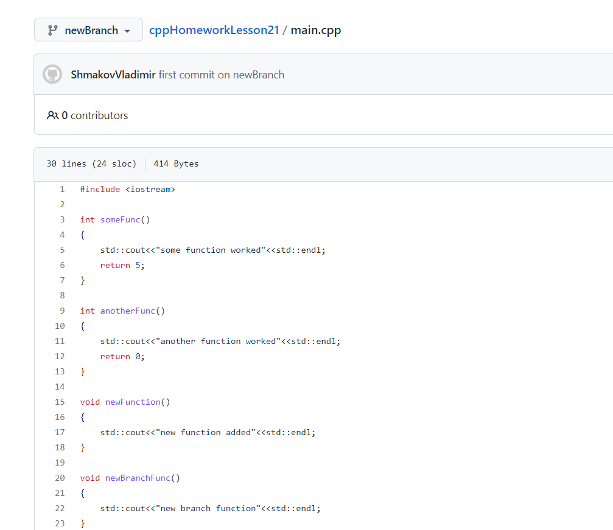
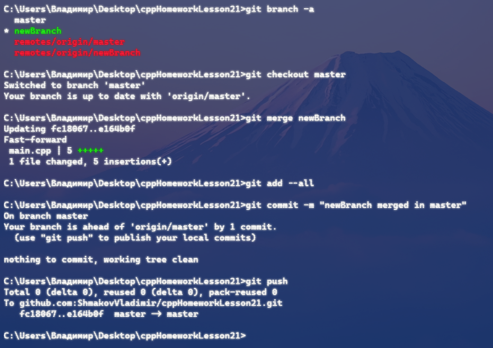
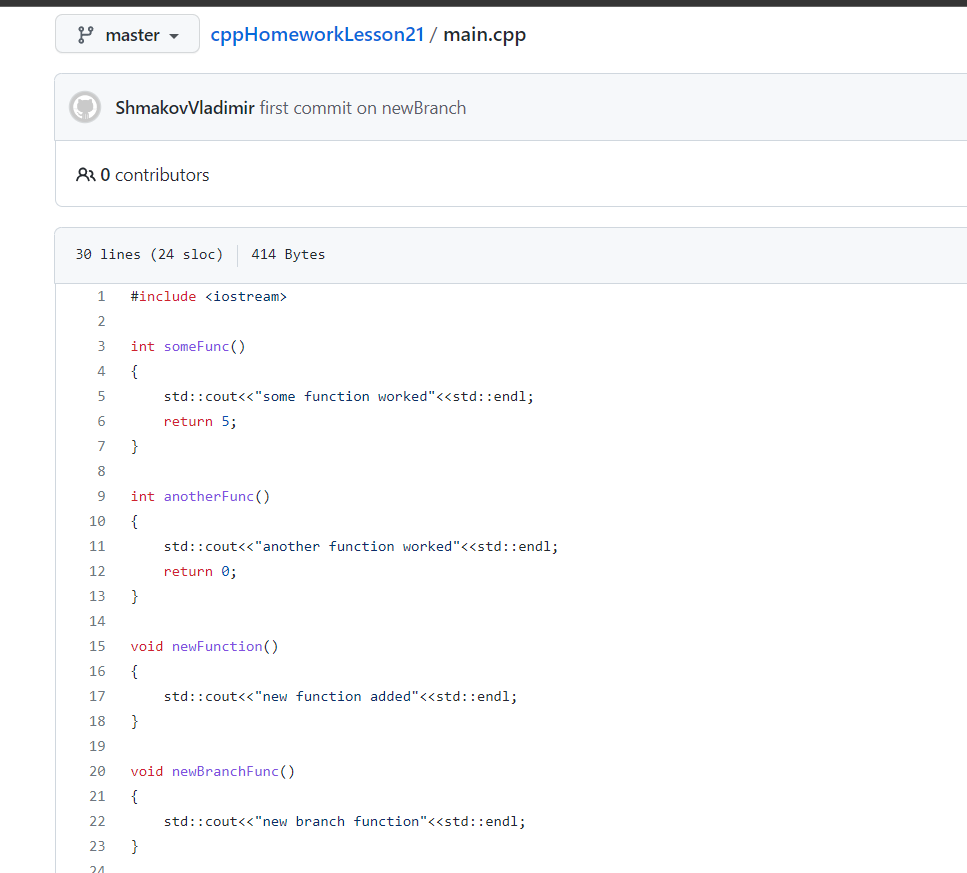
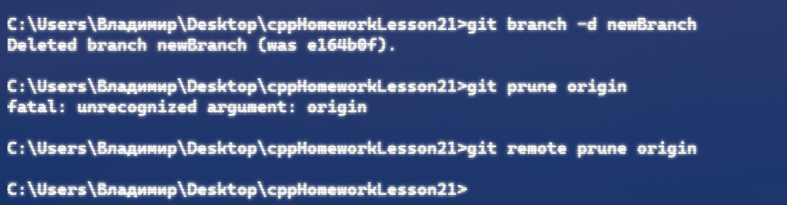
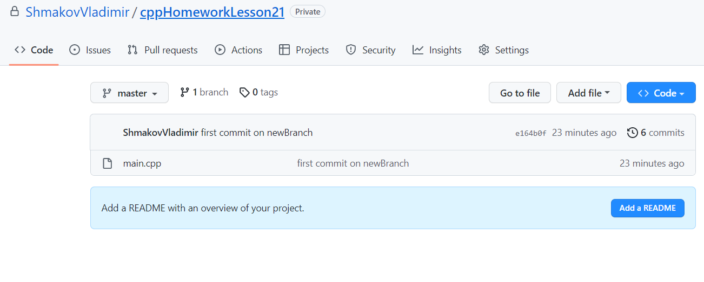

# Основы работы с git

Добавление первого файла(main.cpp) в репозиторий:

Модификация файла main.cpp, и публикация изменений в репозиторий:

### Пункт 1

Добавляем в код две функции `someFunc` и `anotherFunc`. Сначала закоммитим функцию someFunc, а потом anotherFunc:

### Пункт 2

Добавим функцию `newBranchFunc`. И зафиксируем изменение в новой ветке `newBranch`

Как видим, изменения не попали в ветку master:

В ветке `newBranch` изменения присутствуют:

Добавим изменения в ветку master:

Как видим, новая функция `newBracnchFunc` присутствует и в master

Удалим ветку `newBranch`:

Теперь в репозитории только одна ветка master:

