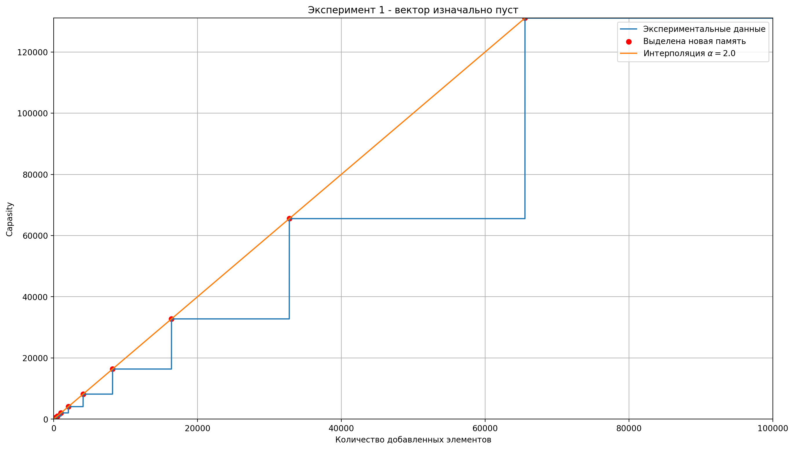
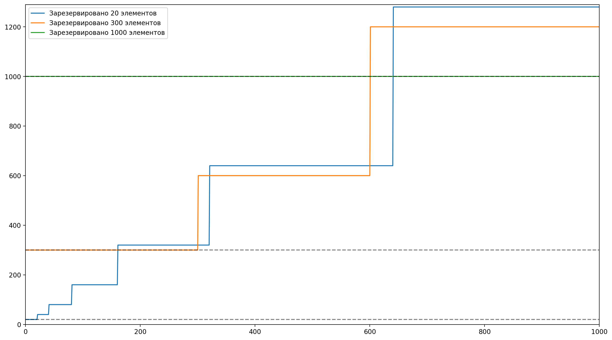
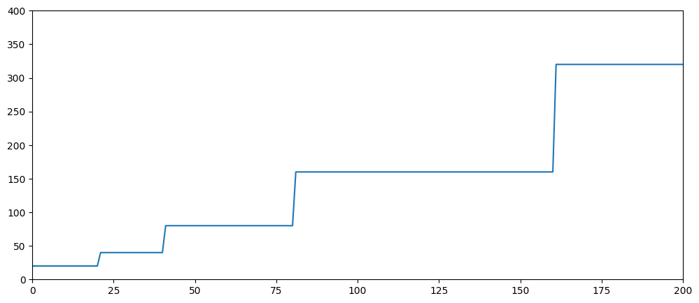
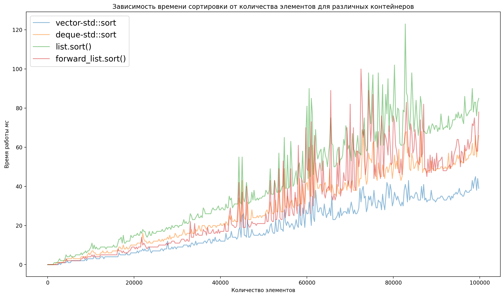
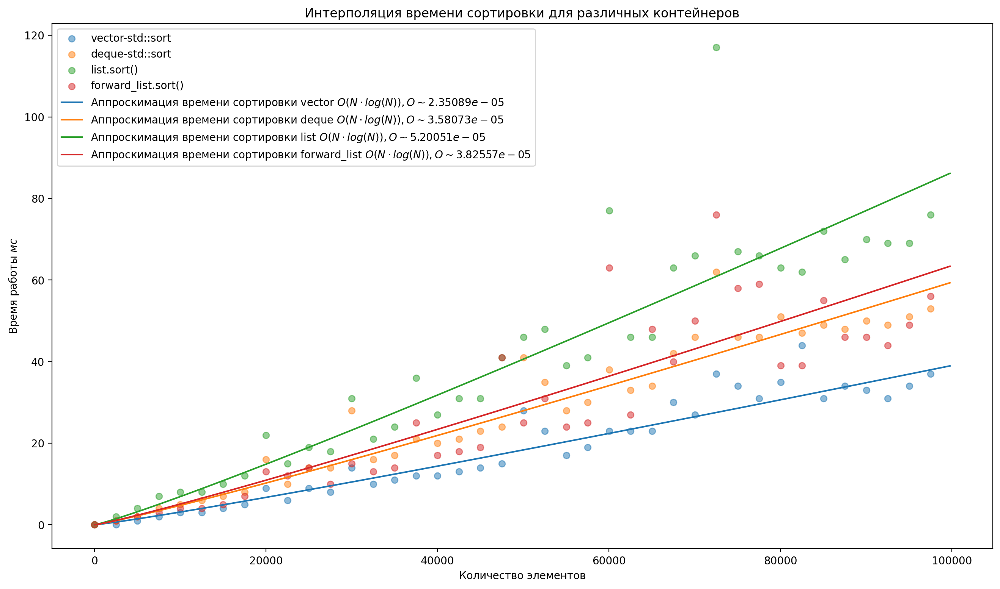

# Семинар 3
- [Семинар 3](#семинар-3)
- [Контрольные вопросы](#контрольные-вопросы)
    - [Типы `std::pair` и `std::tuple`](#типы-stdpair-и-stdtuple)
        - [`std::pair`](#stdpair)
        - [`std::tuple`](#stdtuple)
- [Задача 1 - система выделения памяти в `vector`](#задача-1---система-выделения-памяти-в-vector)
    - [Эксперимент 1](#эксперимент-1)
    - [Эксперимент 2](#эксперимент-2)
    - [Эксперимент 3](#эксперимент-3)
- [Задача 2 - время сортировки различных контейнеров](#задача-2---время-сортировки-различных-контейнеров)

# Контрольные вопросы

### Типы `std::pair` и `std::tuple`

##### `std::pair`
`std::pair` - шаблонный контейнер, позволяющий хранить данные двух разных типов. Например:
```c++
std::pair<int, string> placeAndName(10, "Vovchik");
```

Объект `placeAndName` хранит число и строку. 

Данный контейнер является удобным для хранения любых пар данных. Например для хранения пары `(key, value)`, или `(место, имя)`. 

При этом особенно удобно использовать ключевое слово `typedef`.

##### `std::tuple`

`std::tuple` аналогичен `std::pair`, но даёт возможность хранить большее число данных.

Примечание: **вышеперечисленные контейнеры могут сильно влиять на читаемость кода, поэтому их следует использовать для утилитарных задач типа передачи данных. В остальных случаях лучше использовать структуры**


# Задача 1 - система выделения памяти в `vector`

### Эксперимент 1

Создадим пустой вектор, и последовательно заполним его элементами. Сохраним данные в файл и построим зависимость `capasity` от размера:


Как видим, наилучшая прямая проходящая через <<точки излома>> имеет коэффициент наклона равный двум. 

А значит, при перполнении ёмкость вектора увеличивается вдвое(более подробная проверка в [main.ipynb](task1/main.ipynb))

### Эксперимент 2

Методика проведения аналогична первому эксперименту. Только теперь используется метод `.reserve` сразу после создания объекта `vector`. 

В результате, `capasity` опять увеличивается вдвое:




### Эксперимент 3

Как я ни пытался записать данные - программа крашится.

# Задача 2 - время сортировки различных контейнеров

Для проведения эксперимента написана [простенькая программа на c++](task2/main.cpp), принимающая консольный аргумент, соответсвующий размерам контейнеров.

Метод `.Popen` запускал скрипт, и возвращал бинарную строку, содержащую время работы сортировки для каждого из контейреров.

В результате получили следущие данные:


Используя метод `curve_fit` удалось оценить константы, скрывающиеся под $O$:

> По - хорошему одной выборкиему ноутбуку и так крайне тяжело недостаточно для подобных оценок. Но мой ноутбук так не считает