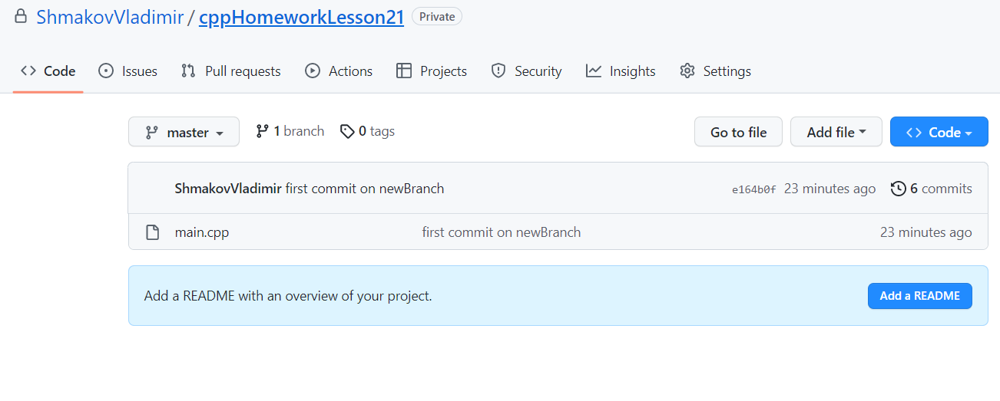

# Второй семестр - задание 1
- [Второй семестр - задание 1](#второй-семестр---задание-1)
    - [Контрольные вопросы](#контрольные-вопросы)
        - [Вопрос 2](#вопрос-2)
        - [Вопрос 3 - из каких основных действий состоит взаимодействие с git](#вопрос-3---из-каких-основных-действий-состоит-взаимодействие-с-git)
        - [Вопрос 4 - когда следует создавать отдельные ветки для разработки](#вопрос-4---когда-следует-создавать-отдельные-ветки-для-разработки)
    - [Задание по git](#задание-по-git)
        - [Пункт 1](#пункт-1)
        - [Пункт 2](#пункт-2)

### Контрольные вопросы

##### Вопрос 2

Система контроля версий решает следущие задачи:
1. Сохранение измненения директории во времени
2. Возвращение проекта в ранее зафиксированное состояние
3. Просмотр изменения проекта во времени

Система контроля версий позволяет работать над проектом используя множество компьютеров. Позволяет ставить задачи для команды разработчиков, и контролировать корректность выполнения поставленных задач. 

Если во время работы над проектом что-то пошло не так, есть возможность <<откатиться>> к ранее записанной стабильной версии проекта.

##### Вопрос 3 - из каких основных действий состоит взаимодействие с git

1. `add` - добавление изменений репозитория в промежуточную область(Index) для последующей фиксации
2. `commit` - сохранение ранее добавленных в Index данных. Сдвиг <<указателя>> текущей ветки
3. `push` - фиксация изменений в удалённом репозитории
4. `pull` - копирование данных с удалённого репозитория
5. `reset` - отмена изменений
6. `branch` - создание ветки/просмотр доступных веток
7. `merge/rebase` - слияние веток, добавление данных из одной ветки в другую

##### Вопрос 4 - когда следует создавать отдельные ветки для разработки

Создавать отдельную ветку стоит при добавлении изменений, существенно влияющих на работу проекта. После проверки работоспособности сделанных изменений, можно добавить их в главную ветку.

### Задание по git

Добавление первого файла(main.cpp) в репозиторий:

Модификация файла main.cpp, и публикация изменений в репозиторий:

##### Пункт 1

Добавляем в код две функции `someFunc` и `anotherFunc`. Сначала закоммитим функцию someFunc, а потом anotherFunc:

##### Пункт 2

Добавим функцию `newBranchFunc`. И зафиксируем изменение в новой ветке `newBranch`

Как видим, изменения не попали в ветку master:

В ветке `newBranch` изменения присутствуют:

Добавим изменения в ветку master:

Как видим, новая функция `newBracnchFunc` присутствует и в master

Удалим ветку `newBranch`:

Теперь в репозитории только одна ветка master:

