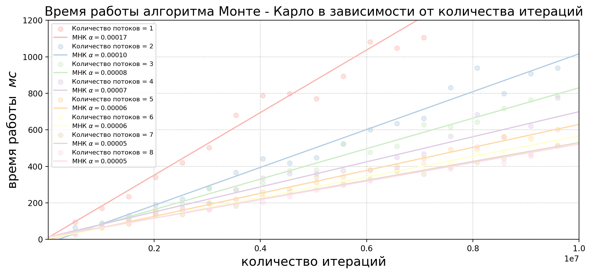

# Урок 7 - многопоточное программирование

- [Урок 7 - многопоточное программирование](#урок-7---многопоточное-программирование)
  - [Пояснения к решенным задачам](#пояснения-к-решенным-задачам)
    - [Многопоточная реализация алгоритма Монте - Карло для оценки числа $\\pi$](#многопоточная-реализация-алгоритма-монте---карло-для-оценки-числа-pi)

## Пояснения к решенным задачам

### Многопоточная реализация алгоритма Монте - Карло для оценки числа $\pi$

- [Однопоточная реализация](https://github.com/ShmakovVladimir/CplusplusHOMEWORK/blob/main/lesson_2_7/monte_carlo/one_thread.cpp)
- [Многопоточная реализация - с использованием `mutex`](https://github.com/ShmakovVladimir/CplusplusHOMEWORK/blob/main/lesson_2_7/monte_carlo/eight_threads.cpp)

Получили следующие результаты:

> Однопоточная реализация

> Многопоточная реализация

**Вывод**

Как видим, многопоточная реализация работает медленнее однопоточной. Почему так происходит? 

Моя версия заключается в том, что большинство временных затрат уходят на работу с разделяемыми ресурсами(переменная `in_circle`, запись в файл). Из - за использования `mutex` эти операции проводятся по - сути в однопоточном режиме. 

Если не использовать `mutex`: [многопоточная реализация без использования mutex](monte_carlo/time_by_iteration_count_test.cpp). Получаем логичный результат(чем больше потоков, тем быстрее):

Однако в данном случае разделяемые ресурсы используются неправильно, вследствие чего алгоритм работает не так, как нужно:

