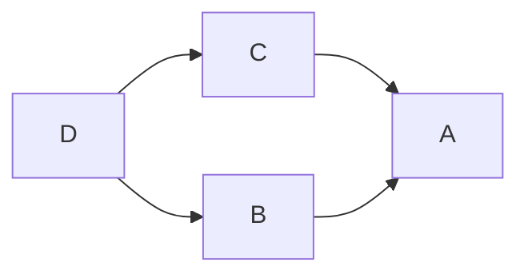

# Контрольные вопросы

### Варианты отношений между классами

Выделяют три основных варианта отношений между классами:
- Композиция
- Наследование 
- Агрегация
- Ассоциация

##### Композиция

**Композиция** - вариант отношений между классами, при котором объект одного класса содержится в другом классе. То есть при создании объекта класса `A` будет также создаваться объект класса `B`.

##### Наследование

Класс `A` является **наследником** класса `B`, если класс `A` содержит весь функционал класса `B`. При этом помимо <<наследованного>> функционала класс `A` может быть дополнен другим функционалом.

При вызове конструктора класса `A` сначала вызывается конструктор класса `B`, инициализирующий все <<наследованные>> поля(создающий класс `B` внутри `A`). Затем вызывается конструктор класса `A`, цель которого инициализировать дополнительные поля и вернуть объект готового класса `A`. 

##### Агрегация

При **агрегации** объект класса `A` создаётся вне класса `B`. Созданный объект передаётся в класс `A`.

При этом агрегация может быть двухсторонней и односторонней. Например объект класса `B` может быть передан в класс `A`, а объект класса `A` передан в класс `B`.

##### Ассоциация

**Ассоциация** - вариант взаимоотношений, содержащий агрегацию и композицию. Другими словами - композиция и агрегация есть частный случай ассоциации.

### Разновидности наследования

В целях инкапсуляции придуманы три вида наследования:

- **private**
- **pritected**
- **public**

**При всех типах наследования члены родительского класса, расположенные в `private` секции, являются недоступными для дочернего класса.** 

##### Public наследование 

При `public` наследовании члены родительского класса, находящиеся в областях видимости `public` и `protected` переходят в области видимости `public` и `protected` дочернего класса:
| Спецификатор доступа в родительском классе | Спецификатор доступа в дочернем классе |
| ------------------------------------------ | -------------------------------------- |
| public                                     | public                                 |
| protected                                  | protected                              |


##### Protected наследование

При `protected` все области видимости кроме `private` становятся типа `protected`:
| Спецификатор доступа в родительском классе | Спецификатор доступа в дочернем классе |
| ------------------------------------------ | -------------------------------------- |
| public                                     | protected                              |
| protected                                  | protected                              |

##### Private наследование
При `private` наследовании секции `public` и `protected` становтся приватными:
| Спецификатор доступа в родительском классе | Спецификатор доступа в дочернем классе |
| ------------------------------------------ | -------------------------------------- |
| public                                     | private                                |
| protected                                  | private                                |

### Виртуальные функциии

Функция называется **виртуальной**, если она предназначена для преопределения в классе наследнике. 

Для корректного функционирования механизма необходимо:

- Переопределять виртуальные функции в классе наследнике. 
- При переопределении использовать ключевые слова:
    - `final` - в классах, являющихся последними в дереве наследования(финальное переопределение функции)
    - `override` - явно указываем на переопределение. Но в следуещем по цепочке наследования классе, функция так же может быть преопределена 
- При объявлении **чисто виртуальных функций** - виртуальных функций не имеющих определения - явно указывать на это, используя синаксис `virtual type virtualFunc(arg) = 0`. 

### Виртуальные классы

В качестве примера рассмотрим схему наследования, которая называется ромбовидным наследованием:

> Здесь класс D является наследником классов C и B. Классы C и B, наследуются от A.

Реализация схемы выглядит примерно так:
```c++
class A
{
   public:
   A() 
   {
       std::cout<<"A constructor"<<std::endl;
   }
};

class B: public A
{
    public:
    B()
    {
        std::cout<<"B constructor"<<std::endl;
    }
};

class D: public A
{
    public:
    D()
    {
    std::cout<<"D constructor"<<std::endl;
    }
};

class C: public D, public B
{
    public:
    C()
    {
        std::cout<<"C constructor"<<std::endl;
    }
};
```

При создании объекта класса `C` в консоль выводится:
>A constructor
D constructor
A constructor
B constructor
C constructor

То есть объект **базового** класса(класса `A`) создался два раза.

В некоторых ситуациях это является проблемой. Если попробовать забрать какие то данные, унаследованные от класса `A`, получим ошибку. Компиллятор не сможет понять у какого конкретно экземпляра класса `A` брать данные. У класса `A` который содержится в `C`, или же у `A`, который содержится в `B`.

Есть два метода решения проблемы:

- Сделать класс `A` **абстрактным** - то есть не определять внутри него никаких полей, а все методы сделать чисто виртуальными.
- Использовать конструкцию виртуального наследования

При использовании конструкции виртуального наследования, мы явно указываем, что при наследовании некоторого класса от нескольких наследников класса `A` следует создавать лишь один экземпляр класса `A`. Так, мы решаем вышеописанную проблему.

### Категории паттернов проектирования

Выделяют три основных категории:

- пораждающие паттерны
- структурные паттерны 
- паттерны поведения

##### Пораждающие паттерны проектирования

Для начала определяется некоторый класс шаблон. Впоследствии все создаваемые классы наследуются от класса шаблона.

Примером является паттерн `factory`.

##### Структурные паттерны проектирования

Основным типом взаимодействия между классами в данном паттерне является ассоциация. То есть из нескольких базовых едениц ООП мы собираем другие, более сложные еденицы.

Пример - `adapter`

##### Паттерны поведения

Похожи на структурные паттерны, но помимо обычных классов создаётся метод, позволяющий запустить цепочку работы алгоритма.

Пример - `template method`


